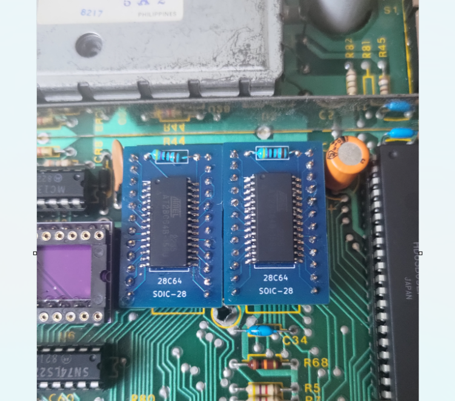

# sop28-to-dip-24-rom-adapter
ROM adapter board from sop-28 to dip-24.

I recently acquired a Color Computer 1 (CoCo 1) that came with Color Basic 1.1 and no Extended Color Basic. The CoCo 1 I have has the revision E motherboard. It contains two 24-PIN sockets next to each other for the Color Basic (CB) and Extended Color Basic (ECB) ROMs. These ROMs are extremely difficult to find and so are 24-PIN EPROMs.

I decided to use the 28C64 EEPROMs to upgrade my machine. The main difficulty is that space is extremely limited around the sockets and there is only a 0.2" (5.08 mm) gap between the two sockets. This means that I needed an adapter board that was no more than 0.8" (20.32 mm) wide. The usual DIP-28 to DIP-24 adapters will not fit. The solution was to use a SOP-28 EEPROM instead of a DIP-28 and to design my own adapter.

This adapter as of revision 2B will only work with the 28C64, not the 28C256 or the 27 series. This is because PIN 1 is left unconnected as per the 28C64 specifications and I didn't provide a way to connect that PIN to ground or a pull-up resistor. PIN 26 is grounded but should probably have been left floating. The 4.7K pull-up resistor is used to bring PIN 27 (/WE) high.

The **bin** folder contains a zip file that can be uploaded directly to JLBPCB for production.

Revision 2B is the same as revision 2 but with a smaller footprint.

